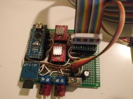
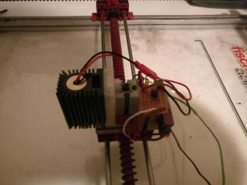
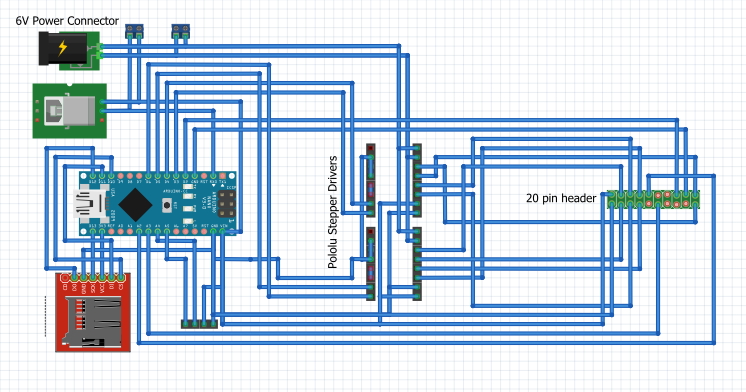

# Fishertechnik Laser Plotter

## Disclaimer

This is no way a 'How-To', but simply serves as a personal reference for future projects with similar hardware / software.

## Hardware

The prototype board houses an Arduino Nano, two Pololu A4988 stepper motor drivers, four screw terminals, a micro sd-card breakout board and a 18x2 digit display. I ended up not using any power connectors as shown in the fritzing schematic, but I would encourage anyone trying something similar to avoid screw terminals and loose power wires! 

Since the stepper motors used in this plotter run on 6v, I supplied 6v through two of the screw terminals and 5v for the arduino through the other pair. In this case it's important to use an external power supply for the stepper motors AND the arduino, as the lcd and sd-card reader draw a lot of current, which might cause unexpected behavior e.g. the arduino rebooting. I decided to use Pololu A4988 stepper motor drivers, since they were cheap and I didnt expect the motors to draw much current.

What isn't shown in the schematic is a transistor between 5V power and one of the spare data pins in the plotter's ribbon cable. The laser is attached to the head of the plotter using a 3d-printed adapter.

## Software

I wrote the code for the arduino in [Visual Studio 2017 Community Edition](https://visualstudio.microsoft.com/downloads/) with the [VisualMicro](https://www.visualmicro.com/) extension. Since VisualMicro also uses .ino files, you don't need the extension to work with the code, although I highly recommend it. Before moving on to soldering the prototype, I created a schematic in [Fritzing](http://fritzing.org/home/) as seen below. 

To plot something choose the software of your choice to generate gcode based on the shape you want the laser to engrave. The laser turns on when the Z axis is set below zero, so the best settings are usually the defaults used in milling. Then rename the generated gcode to gcode.txt and upload it to a micro-sd card. Plug in the sd-card, turn on the arduino and VOILA!

The arduino is running a primitive gcode interpreter, which skips any commands it doesnt understand or deems unnecessary for plotting.

## References

[A4988 Stepper Motter Driver](https://www.pololu.com/product/1182)   
[Fishertechnik Plotter](http://ft-datenbank.de/web_document.php?id=695a76ad-4e9f-4d97-b8d0-891ff10766a1)   
[Laser Module](https://www.amazon.de/gp/product/B06XGCW5G7/ref=oh_aui_detailpage_o04_s00?ie=UTF8&psc=1)
